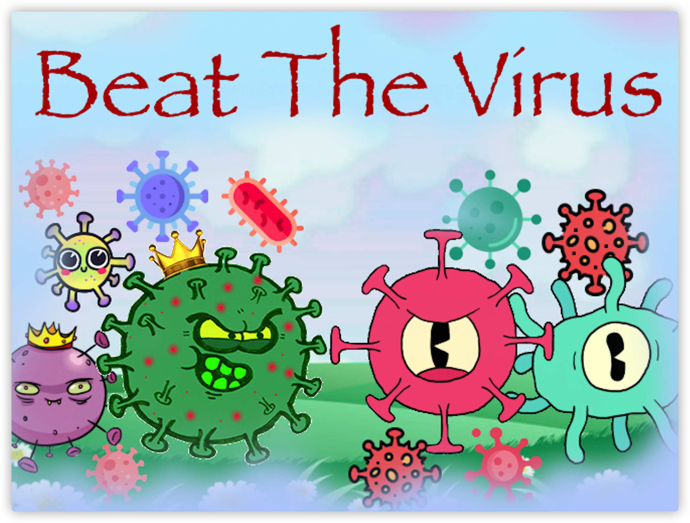

## Beat The Virus

My swift playground book is called "Beat The Virus", which is a game that uses gesture recognition to eliminate viruses. Each virus in the game will have several symbols on its head. Just draw the arrows one by one, and the virus will be eliminated. You will appear in the game as a warrior who eliminates the virus, and the virus will "launch" an attack on you. Be careful not to let the virus get close to you, or you will get hurt!

## Features of this game

Viruses in the game have many special abilities: some can be invisible from time to time, some can reproduce themselves, and some have resurrection skills. Remembering their characteristics will make you more skilled! If you don’t remember it, don’t worry at all. There will be some guidance before the game to help you get started with this game quickly and understand the characteristics of each virus. You have to be especially careful with viruses that are closest to you and capable of self-reproduction. They are the most dangerous. Hope you can eliminate more viruses and get higher scores! At the end of the game, you can also customize your own levels, I believe you can feel the charm of "Beat The Virus".

## virus in game

